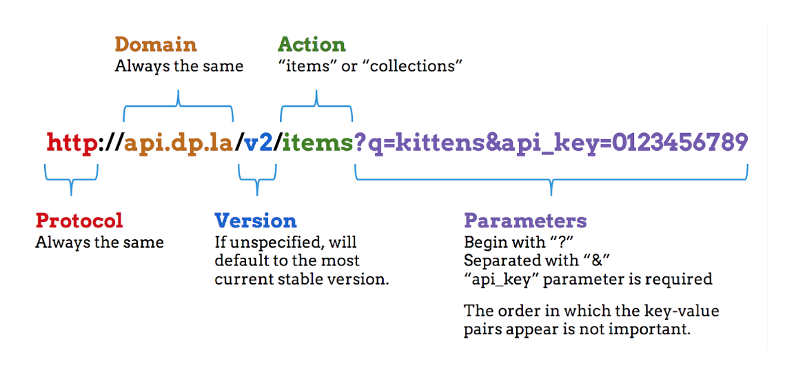

## Getting Data

During this session you will be introduced to a variety of methods to
get data from collections, documents, and the web.

### Tools and Platforms

-   [*Web Scraper*](https://webscraper.io/)
-   [*DownThemAll*](https://addons.mozilla.org/en-US/firefox/addon/downthemall/)
-   *cURL*
-   [*Postman*](https://www.getpostman.com/)
-   [*DPLA API*](http://dp.la/info/developers/codex/)

### Data

-   [*Digital Public Library of America*](https://dp.la/search?q=lobby%20card&subject=%22Motion%20picture%20posters%22)

## Scraping a Website

### Tool: [webscraper.io](http://webscraper.io)

#### Description

A freemium web scraping Chrome plugin.

#### Why you might need it

You want to scrape tabular data from the web, output to CSV format, and
don’t want to mess with BeautifulSoup.

#### Scenario

You want to capture metadata that corresponds to motion picture “lobby
cards,” to include in a database of movie memorabilia.

#### Activity

Use Web Scraper to extract data in CSV format from the following source or
one of your own:

-   A search in DPLA for ‘lobby card’ with the ‘Motion Picture Posters’
    facet selected: [*https://dp.la/search?q=lobby%20card&subject=%22Motion%20picture%20posters%22*](https://dp.la/search?q=lobby%20card&subject=%22Motion%20picture%20posters%22)

#### Directions

1.  Navigate to [*https://dp.la/search?q=lobby%20card&subject=%22Motion%20picture%20posters%22*](https://dp.la/search?q=lobby%20card&subject=%22Motion%20picture%20posters%22) in a Chrome browser
2.  Open Web Scraper— either hit Cmd+Opt+I on Mac or click on the three dots in the upper right corner, then hover over ‘More Tools,’ then select ‘Developer Tools’
3.  Select the ‘Web Scraper’ tab on the window that pops up—you may need to scroll to the right to access it.
4.  Click on the ‘create new sitemap’ button and name this ‘dplaposters’ Paste in the URL ([*https://dp.la/search?q=lobby%20card&subject=%22Motion%20picture%20posters%22*](https://dp.la/search?q=lobby%20card&subject=%22Motion%20picture%20posters%22)) under ‘Start URL’ and then click ‘Create Sitemap.’
5.  Click on the blue button near the bottom that says ‘Add New Selector.’
6.  We want to do this in steps—first we want to identify each individual item on the page, then we want to specify the specific information we want to get from each item. For ‘Id’ we’ll call this ‘item.’ Then select ‘Element’ from the ‘type’ dropdown. This will allow us to select the entire piece of HTML that encloses all of the information.
7.  Click on ‘Select’ and then hover over the first item until there’s a green box around the entire thing. Be sure that it includes the photo and the text (I’ve found that the bottom right corner of the item works well). Click to turn the box green and then select the next item, again making sure that the entire area is highlighted green. Once you click, it should turn all of the items red.
8.  Click on the blue ‘Done selecting!’ button. Scroll down a little and check the ‘Multiple’ box, and then click ‘Save selector’ at the bottom.
9.  This should show you a table with information about the selector you just created. Click on that table row so that you can make child selectors. Each of these will now operate on every ‘item’ selector that you created.
10. Click on ‘Add new selector,’ and name it ‘title.’ Click the ‘select’ button and click on the title of the first item—the whole box should be highlighted yellow. Once you’ve clicked the first title to highlight it red, click ‘Done selecting!’ and scroll down to click ‘Save selector.’ [Note: We’re not selecting multiple here because this is operating on each individual item, not the whole page at once.]
11. Repeat this process for the ‘year,’ ‘producer,’ and ‘archive’ (the last part of text that identifies the metadata provider).
12. Add a new selector, name it ‘itemlink’ and select ‘link’ from the dropdown. Then click on ‘View Full Item’ (this will annoyingly open a new tab, but you can just close it). Click “Done selecting!’ and then ‘Save selector.’
13. Now that you have all of the information you’d like selected, we can run a quick check to see if it’s scraping everything correctly. Scroll to the top of the Web Scraper screen and click on ‘Sitemap dplaposters,’ then click ‘scrape.’ This will ask us to approve the delay and interval (to be nice to the server), and we can click ‘Start scraping.’ This will pop open and then eventually close a new window. Click ‘Refresh’ to view the data we’ve scraped.
14. There are a few columns that we don’t really need (and can easily delete later), but this should include all of the information we want. HOWEVER, this only includes the 20 items that are currently on the page, not the 70 total that come up in the search. We’ll need to make it so the scraper will run through each page of results and scrape every item. [See note below]
15. Click on ‘Sitemap dplaposters’ and then ‘selectors,’ and then click \_root. This will show us the first selector we made—the one that finds each item on the page. Click on ‘Add new selector,’ and call it ‘pagination.’ Select the type ‘link,’ and then click ’select.’ click on ‘next’ near the bottom of the page and save.
16. Click on the \_root link and then click on the ‘item’ selector’s edit button.
17. Scroll down to where you determine parent selectors and, while holding down Cmd (ctrl on Windows), click on ‘pagination’. This should make ‘item’ a child of both \_root and pagination.
18. If you want to double-check your work (and maybe better understand what’s going on), click on ‘Sitemap dplaposters’ and then ‘Selector graph.’ If you click on \_root and then item, you should see that you’ve created a never-ending loop.
19. Once everything looks ok, click on ‘Sitemap dplaposters’ and then click ‘Scrape.’ Once that’s done, go back to ‘Sitemap dplaposters’ and click on ‘Export data as CSV.’ Click on the download link and examine the data—there are sever al columns that you’ll probably want to delete. [Note: There are actually two (slightly easier) other ways we could capture all of these results. Since there are 70 results on this search, we could change DPLA’s results setting to display up to 100 items per page. We could also take a look at the way the URLs change with each page and set our [*home url to end with a range of pages*](http://webscraper.io/documentation#scraping-a-site) (for ex: ‘&page=[1-3]’ ). These solutions may not work in every case, so the use of a pagination selector is a bit more versatile.]

## Bulk Downloading
### Tool: [DownThemAll](https://addons.mozilla.org/en-US/firefox/addon/downthemall/)

#### Description

A Firefox extension that lets you download links and files from web based content via graphical user interface.

#### Why you might need it

You want to grab files in bulk from a webpage, be selective about it, and rename them automatically.

#### Scenario

You want to study the way scholars talked about the films included in the Library of Congress's National Film Registry by analyzing the essays on the LC website.

#### Activity

Use DownThemAll to download multiple texts from the collection below or one of your own choosing:

-   [*loc.gov/programs/national-film-preservation-board/film-registry/index-of-essays/*](https://www.loc.gov/programs/national-film-preservation-board/film-registry/index-of-essays/)

#### Directions

1.  Navigate to
    [*loc.gov/programs/national-film-preservation-board/film-registry/index-of-essays/*](https://www.loc.gov/programs/national-film-preservation-board/film-registry/index-of-essays/)
2.  Right-click on an empty part of the screen and select DownThemAll
3.  DownThemAll displays all available files to download from the current page as links. There are a number of presets built in to select certain types of files. Unfortunately for you, your desired filetype does not have a preset. Do some digging on the page to find the extension you need and specify it in the fast filtering section - if you don’t everything just click on the files you want to download.
4.  Before downloading, set the folder you would like downloaded files to go into using the ‘Save Files in’ feature.

### Alternative Bulk Downloading

Based on tools we’ve worked with…..can you think of another way to bulk download those PDFs?

## Using an API to download metadata
### Tool: [*DPLA API*](http://dp.la/info/developers/codex/) / [*Postman*](https://www.getpostman.com/)

#### Description

An API (application programming interface) is a defined set of methods for communicating with a software system. Postman is a simple interface to develop and evaluate API requests. This can also be done using cURL on the command line, or through any web browser.


*Image from [DPLA's API Codex](https://pro.dp.la/developers/api-codex)*

#### Why you might need it

It can be used for bulk downloading of data objects from DPLA or, with a few simple modifications, many other repositories or platforms.

#### Scenario

You discover that the Digital Public Library of America has [*96 motion picture posters from the
US*](https://dp.la/searchsubject=%22Motion%20picture%20posters%22&page=1&type=%22image%22&location=%22United%20States%22) in the portal. Do these match up with posters you’ve found from other sources? You could click through each one to make sure you have them all. Or you could capture the metadata for all of DPLA’s images and compare them with the metadata you already havep. Let’s do that one.

#### Activity

Use Postman and the DPLA API to extract metadata for motion picture
posters in the collection.

#### Directions

Open Postman and click on ‘Request.’

1. Title the request name ‘DPLA movie posters.’ Near the bottom, click ‘Create Collection’ and type ‘DPLA movie posters’ again.
2. Enter the DPLA API items request URL (http://api.dp.la/v2/items) into the “Enter request URL here” field and make sure GET is selected in the dropdown box on the left.
3. Click ‘Params’ to add a blank for a URL Parameter Key and Value. Enter “api_key” in the ‘URL Parameter key’ space and in the ‘Value’ space, paste in the temporary API key for this workshop. ([*Here’s how you can get your own*](http://dp.la/info/developers/codex/policies/#get-a-key))
4. To make sure everything’s working, click “Send.”
`http://api.dp.la/v2/items?api_key=YOUR_API_KEY`

You should receive over 21 million items. Unfortunately, some of those aren’t movie posters. Earlier, when you located those 96 motion picture posters, you came across the helpful subject heading “Motion picture posters.”

According to the [*API request documentation*](http://dp.la/info/developers/codex/requests/), you can use “sourceresource.[fieldname]" to search for specific metadata fields associated with an object. Let’s try that.

5. Enter the following:
```
Key: sourceResource.subject   Value (with quotation marks): “Motion picture posters”
Key: sourceResource.type    Value: image
Key: sourceResrouce.spatial.name   Value: United States
```

You should see this developing a longer URL near the top of the screen that strings all of these requests together

*This should return 96 responses in JSON. You’ll notice, however, that there’s a default limit of 10, so you’re only seeing the first 10 results. To see the next page, you could add the key “page’ and value “2” to see the next ten. Or, you could expand the limit.*

5. That’s what we’ll do.
```
Key: page_size Value: 100
```
>*Now we have the JSON metadata for all of them, but a lot of this is unnecessary for our evaluation. Let’s return something a bit more tidy using the ‘fields’ key to only return the information we need.*

>Here are some useful fields:

- **sourceResource.title** — the title of the object
- **isShownAt** — a URL to the digital object on the provider’s web site in its full information context
- **sourceResource.creator** — entity primarily responsible for making the object
- **sourceResource.date—array** - of dates associated with an event in lifecycle of an object*
- **sourceResource.description** — description of the object
- **object** — URL reference to the DPLA preview of the object

6. Add the following:

```
Key: fields   Value: sourceResource.title, isShownAt, sourceResource.creator, sourceResource.date, sourceResource.description, object
```

7. If this looks good, go ahead and select the response (Cmd/Ctrl+ A),
copy it (Cmd/Ctrl+ C), and paste it into your text editor of choice.

**Further Resources**

- Ian Milligan, [*Automated Downloading with
Wget*](http://programminghistorian.org/lessons/automated-downloading-with-wget)
- Free Software Foundation, [*Wget
Manual*](http://www.gnu.org/software/wget/manual/wget.html)
- Digital Public Library of America, [*API
Codex*](http://dp.la/info/developers/codex/) & [*DPLAFest 2015 Hackathon
Slides*](https://docs.google.com/presentation/d/1kVgyegobaJzDeJXKq3hn6_yW031xyCkA3xx60VqjlW4/edit#slide=id.p)
